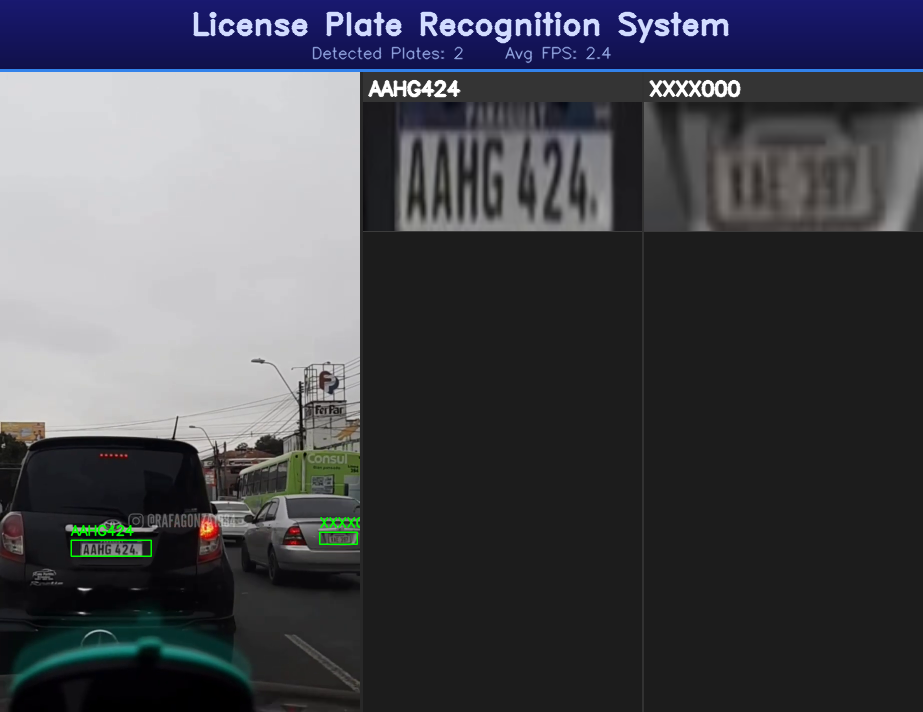

# Realtime Car Plate Recognition

A complete end-to-end pipeline for **real-time vehicle license plate detection and OCR** using YOLOv8 (exported to ONNX) and EasyOCR, with a temporal tracking system featuring ghost tracks and majority voting.

<p align="center">
  
</p>

---

## Project Structure

```
car_plates_recognition/
│
├── 0_Dataset/
│   └── License_Plate_Recognition_yolov8.zip   # Raw Roboflow dataset (~515 MB)
│
├── 1_Notebook_for_train_the_model/
│   ├── Yolo_Trainer.ipynb                      # Full training + hyperparameter search notebook
│   └── yolo_onnx_convertion.py                 # Exports trained .pt model to ONNX format
│
├── 2_Project_Code/
│   ├── Plate_Recognition.py                    # Main pipeline — real-time video processing
│   ├── Plate_Recognition_test.py               # Single-image inference pipeline
│   ├── detector.py                             # ONNX-based plate detector (YOLOv8)
│   ├── ocr_engine.py                           # EasyOCR + preprocessing + text correction
│   ├── tracker.py                              # Temporal tracker with coasting / ghost tracks
│   ├── utils.py                                # Image & GUI utilities
│   └── resources/
│       ├── chapitas.onnx                       # Exported ONNX model (~42 MB)
│       ├── modelito_chapitas.pt                # Trained YOLOv8 weights (~21 MB)
│       ├── Tránsito en Asunción.mp4            # Demo video (~14 MB)
│       └── test_image.jpg                      # Sample image for single-image mode
│
└── 3_Multimedia/
    └── Plates.png                              # Reference image / project thumbnail
```

> **Note:** Model files (`.onnx`, `.pt`), videos (`.mp4`), dataset archives (`.zip`), and the `output/` folder are excluded from Git via `.gitignore`.

---

## Features

- **YOLOv8 ONNX Detection** — Fast inference via ONNX Runtime (CPU or CUDA), no PyTorch required at runtime. Default: `conf=0.25`, `iou=0.45`, `imgsz=224×224`.
- **Multi-variant OCR** — Each plate crop is preprocessed into **4 variants** (CLAHE+denoising, adaptive threshold, grayscale-binary fusion, Otsu+dilation) and fed to EasyOCR with weighted voting and an ideal-length bonus (7 chars).
- **Perspective rectification** — `minAreaRect` corrects tilted plate crops before OCR.
- **Temporal tracking with coasting** — Plates keep their last confirmed text on screen for up to ~1.5 s after disappearing (ghost tracks with progressive fade-out).
- **Dynamic capture radius** — The tracker's association radius shrinks linearly the longer a track goes without being detected, preventing wrong ghost-track claims.
- **Majority vote confirmation** — Text is only "confirmed" once it appears consistently across a rolling OCR window (`history_len=12`, `min_votes_to_confirm=3`).
- **LLLLNNN format correction** — Position-aware post-processing maps OCR errors to the expected 4-letter + 3-digit plate format (e.g. `0→O`, `1→I` in letter positions; `O→0`, `I→1` in digit positions).
- **Composite UI** — Side-by-side layout: annotated video on the left, a scrollable plate panel on the right, midnight-blue title bar with live FPS stats on top.
- **Single-image mode** — `Plate_Recognition_test.py` runs the full detection + OCR pipeline on a static image and reports total inference time in milliseconds.
- **Hyperparameter optimization** — Optuna-based search over 15 YOLO training hyperparameters (lr, momentum, augmentations, loss weights, …).

---

## Architecture

```
Video / Image Frame
        │
        ▼
┌────────────────┐
│  PlateDetector │  detector.py — letterbox → ONNX Runtime → decode [1,5,N] → NumPy NMS → xyxy boxes
└──────┬─────────┘
       │  plate crops  (make_high_quality_crop: lateral margin + 10% vertical trim)
       ▼
┌────────────────┐
│  OCREngine     │  ocr_engine.py — rectify_plate → 4 variants (2× upscale) → EasyOCR
│                │                → weighted vote + length bonus → fix_plate_by_position
└──────┬─────────┘
       │  (text, confidence, is_valid)
       ▼
┌────────────────┐   ← video mode only
│  PlateTracker  │  tracker.py — centroid matching (dynamic radius)
│                │            → deque history → majority vote → ghost tracks / fade-out
└──────┬─────────┘
       │  (display_text, is_confident)
       ▼
  Annotated Frame ──► composite: [video | separator | plate panel] + title bar
                  ──► saved to output/ (video .mp4 or image .jpg)
```

---

## Installation

### Requirements

```bash
pip install easyocr opencv-python onnxruntime numpy
```

> **GPU support:** Replace `onnxruntime` with the GPU build and install the matching PyTorch:
> ```bash
> pip install onnxruntime-gpu
> pip install torch torchvision torchaudio --index-url https://download.pytorch.org/whl/cu118
> ```
> CUDA is auto-detected at runtime for both the ONNX detector and EasyOCR.

For training only (not needed at inference time):
```bash
pip install ultralytics roboflow optuna
```

---

## Usage

### Real-time video processing

```bash
cd 2_Project_Code
python Plate_Recognition.py
```

Entry point at the bottom of [Plate_Recognition.py](2_Project_Code/Plate_Recognition.py):

```python
video_path  = "resources/Tránsito en Asunción.mp4"
model_path  = "resources/chapitas.onnx"
output_path = "output/salididita.mp4"

main(video_path, model_path, output_path,
     display=True,
     crop_top_ratio=0.5,    # ignore the top 50% of the frame (sky / buildings)
     save_crops=False,
     target_height=640)     # video pane height; width adapts to native aspect ratio
```

| Parameter | Default | Description |
|---|---|---|
| `display` | `True` | Show live OpenCV windows |
| `crop_top_ratio` | `0.5` | Fraction of frame height to skip from the top |
| `save_crops` | `False` | Save individual plate crop images to `crops/` |
| `target_height` | `640` | Height (px) of the video pane in the composite window |

Press **`q`** to quit the live window.

---

### Single-image inference

```bash
cd 2_Project_Code
python Plate_Recognition_test.py
```

Entry point at the bottom of [Plate_Recognition_test.py](2_Project_Code/Plate_Recognition_test.py):

```python
image_path  = "resources/test_image.jpg"
model_path  = "resources/chapitas.onnx"
output_path = "output/test_result.jpg"

run_image(image_path, model_path, output_path,
          display=True, crop_top_ratio=0.5, target_height=640)
```

Same composite layout as the video mode. The subtitle shows **total pipeline inference time in ms** instead of FPS. The tracker is not used — each image is processed independently.

---

## Training

Open [Yolo_Trainer.ipynb](1_Notebook_for_train_the_model/Yolo_Trainer.ipynb) in Jupyter / VS Code.

The notebook covers:

1. **Library installation** — `ultralytics`, `optuna`, PyTorch with CUDA.
2. **GPU verification** — `nvidia-smi` + PyTorch CUDA diagnostic.
3. **Dataset unzip & inspection** — unpacks the Roboflow dataset and prints split statistics.
4. **Hyperparameter search** — Optuna study over 15 parameters, 10 trials, maximising `mAP50`.
5. **Final training** — 270 epochs with the best hyperparameters found.
6. **Metrics visualisation** — loss curves and precision/recall/mAP plots.

### Dataset

| Split | Images | % |
|---|---|---|
| Train | 7 057 | 69.70 % |
| Valid | 2 048 | 20.23 % |
| Test  | 1 020 | 10.07 % |

Source: [Roboflow — License Plate Recognition v11](https://universe.roboflow.com/roboflow-universe-projects/license-plate-recognition-rxg4e/dataset/11) (CC BY 4.0)

### Export to ONNX

After training, run [yolo_onnx_convertion.py](1_Notebook_for_train_the_model/yolo_onnx_convertion.py):

```bash
python yolo_onnx_convertion.py
```

Edit `MODEL_PATH` to point to your `.pt` checkpoint. The script exports with `imgsz=224`, `opset=12`, and `simplify=False` (required for correct ONNX Runtime decoding of the `[1, 5, N]` output tensor).

---

## Module Reference

### `detector.py`

| Symbol | Description |
|---|---|
| `letterbox(image, new_size, color)` | Resize preserving aspect ratio, pad to square with solid color |
| `preprocess(frame_bgr, imgsz)` | BGR → RGB → letterbox → normalized float32 NCHW tensor `[1,3,H,W]` |
| `nms(boxes, scores, iou_threshold)` | Pure-NumPy Non-Maximum Suppression |
| `decode_output(raw, ...)` | Decodes `[1, 5, N]` ONNX output → xyxy boxes in original frame coordinates |
| `PlateDetector` | High-level class; auto-selects CUDA or CPU; `.detect(frame_bgr)` → `(boxes, scores)` |

### `ocr_engine.py`

| Symbol | Description |
|---|---|
| `rectify_plate(img)` | Perspective correction via `minAreaRect`; falls back to original on failure |
| `prepare_for_ocr_strong(crop_raw, target_w)` | Generates 4 grayscale variants: CLAHE+denoise, adaptive threshold, fusion, Otsu |
| `perform_ocr_variants(reader, crop_raw)` | EasyOCR over all 4 variants (2× upscaled), weighted vote + 7-char length bonus |
| `fix_plate_by_position(raw)` | Corrects to LLLLNNN format; returns `(corrected_text, is_valid: int)` |
| `OCREngine` | High-level class; `.read(crop_bgr)` → `(text, conf, valid)` |

Correction maps — **letter positions (0–3):** `0→O  1→I  2→Z  5→S  6→G  8→B`  
Correction maps — **digit positions (4–6):** `O→0  Q→0  D→0  I→1  L→1  Z→2  S→5  B→8`

### `tracker.py`

| Symbol | Description |
|---|---|
| `PlateTracker.update(cx, cy, text, box)` | Registers OCR reading; creates new track or updates existing; returns `(display_text, is_confident)` |
| `PlateTracker.tick_all(active_centers)` | Increments `missed_frames` for all tracks not matched this frame |
| `PlateTracker.get_ghost_tracks()` | Returns coasting tracks (1 ≤ missed_frames ≤ max) with confirmed text |
| `PlateTracker.cleanup_old_tracks()` | Removes tracks exceeding `max_missed_frames` |

Default tracker parameters (set in `Plate_Recognition.py`):

| Parameter | Value | Description |
|---|---|---|
| `history_len` | `12` | Rolling OCR vote window per track |
| `dist_threshold` | `100 px` | Base centroid-matching radius |
| `min_votes_to_confirm` | `3` | Votes to lock in `confirmed_text` and `best_box` |
| `max_missed_frames` | `45` | ~1.5 s at 30 fps before track expiry |
| `ghost_min_ratio` | `0.25` | Minimum radius fraction for ghost tracks |

Centroid smoothing: exponential moving average `(70% old + 30% new)`.

### `utils.py`

| Symbol | Description |
|---|---|
| `can_show_windows()` | Probes whether the runtime supports OpenCV GUI windows |
| `smart_resize_and_pad(img, target_size)` | Aspect-preserving resize + white padding to exact `(H, W)` |
| `unsharp_mask(img, ...)` | Sharpening via Gaussian unsharp mask |
| `enhance_for_display(img, display_w)` | CLAHE (LAB) + unsharp sharpening for on-screen crop display |
| `create_gallery(crops, labels, crop_display_size)` | Horizontal mosaic of enhanced crop tiles with OCR labels |
| `make_high_quality_crop(frame, x1, y1, x2, y2, ...)` | Plate crop with lateral margin and ~10% vertical inward trim |

---

## Output

| File | Description |
|---|---|
| `output/salididita.mp4` | Composite video output (video mode) |
| `output/test_result.jpg` | Composite image output (single-image mode) |
| `crops/` | Optional individual plate crops (`save_crops=True`) |

---

## Demo Video

<p align="center">
  <a href="https://youtu.be/le9dOvcr2To" target="_blank">
    
  </a>
</p>

---

## License

Dataset: **CC BY 4.0** (Roboflow Universe).  
Code: feel free to use and adapt.
